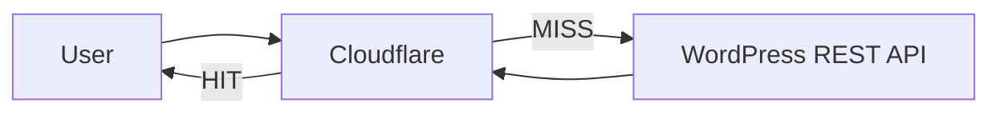

# キャッシュ設計

## 概要

WordPress REST API のレスポンスを Cloudflare でキャッシュし、Next.js フロントエンドへの高速配信と WP サーバー負荷軽減を実現する。

## アーキテクチャ



---

## キャッシュ戦略

| 対象 | キャッシュ時間 | 備考 |
|---|---|---|
| 投稿一覧 `/wp/v2/posts` | 1時間 | VOD status 更新頻度に合わせる |
| 投稿詳細 `/wp/v2/posts/{id}` | 1時間 | ACF 更新後にパージ |
| taxonomy `/wp/v2/vod` | 24時間 | 変更頻度低 |

---

## キャッシュクリア（Purge）

スクレイパーが ACF を更新したタイミングで対象投稿のキャッシュをパージする。

```bash
curl -X POST "https://api.cloudflare.com/client/v4/zones/YOUR_ZONE_ID/purge_cache" \
  -H "Authorization: Bearer YOUR_API_TOKEN" \
  -H "Content-Type: application/json" \
  --data '{"files": ["https://example.com/wp-json/wp/v2/posts/12345"]}'
```

詳細設定は [cloudflare-cache-setup.md](cloudflare-cache-setup.md) を参照。
