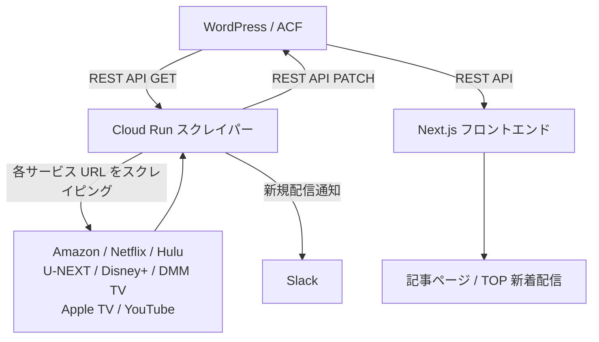

# 運用・設計

## システム概要

映画・コンテンツの VOD 配信状況を自動管理するシステム。
WordPress ACF をデータストアとし、Cloud Run スクレイパーが定期的に各 VOD サービスの配信状況を取得・更新する。

---

## 運用フロー

```
① 記事作成（WordPress 管理画面）
   └─ ACF に各サービスの scraping_url を登録

② Cloud Scheduler が定期起動（Cloud Run）

③ スクレイパーが WP REST API から投稿一覧を取得

④ 各サービス URL にアクセスして配信状況を判定

⑤ WP REST API PATCH で ACF を更新
   ├─ {service}_status
   ├─ {service}_price
   ├─ {service}_updated_at
   └─ {service}_streaming_started_at（新規配信時のみ）

⑥ vod taxonomy を同期
   ├─ streaming → term を追加
   └─ streaming 以外 → term を削除

⑦ 新規配信を Slack 通知
   └─ 前回 status が streaming 以外 → 今回 streaming になった場合

⑧ Next.js フロントエンドが WP REST API から取得して表示
```

---

## アーキテクチャ



---

## スクレイピングスキップ条件

以下に該当する場合、そのサービスのスクレイピングをスキップする。

| 条件 | 判定フィールド | 備考 |
|---|---|---|
| scraping_url が未登録 | `{service}_scraping_url` が空 | URL 未登録は対象外 |
| 独占配信サービスが他社 | `is_exclusive = true` かつ `exclusive_service` が対象サービスと不一致 | Netflix オリジナル等 |
| スクレイピング停止期間中 | `scraping_cooldown_until >= today` | 古い作品・長期未配信作品 |
| 言語不一致 | `languages` に対象サービスの対応言語が含まれない | ja のみ作品に Crunchyroll 等 |
| 直近更新済み | `{service}_updated_at` が 30 日以内 | `--force` オプションで上書き可 |

---

## 新規配信検知

```
スクレイピング実行時：

前回 status ≠ streaming（または未取得）
今回 status = streaming
        ↓
{service}_streaming_started_at = 現在日時（初回のみ記録）
        ↓
Slack Webhook で通知
        ↓
Next.js TOP「新着配信」セクションで 7 日以内の作品を表示
```

- `streaming_started_at` は一度セットされたら上書きしない（再配信でも保持）
- 環境変数 `SLACK_WEBHOOK_URL` が未設定の場合は通知をスキップ

---

## サービス一覧

| サービス | キー名 | 言語 | スクレイピング方式 |
|---|---|---|---|
| Amazon Prime Video | `amazon_prime_video` | ja / en | requests + BeautifulSoup |
| Netflix | `netflix` | ja / en | requests + BeautifulSoup |
| Hulu | `hulu` | ja | requests + BeautifulSoup |
| U-NEXT | `unext` | ja | Playwright（Chromium） |
| Disney+ | `disney_plus` | ja / en | requests + BeautifulSoup |
| DMM TV | `dmm_tv` | ja | Playwright（Chromium） |
| Apple TV | `apple_tv` | ja / en | requests + BeautifulSoup（実装予定） |
| YouTube | `youtube` | ja / en | requests + BeautifulSoup |

---

## 環境変数

| 変数名 | 用途 | 必須 |
|---|---|---|
| `WP_API_URL` | WordPress REST API ベース URL | ○ |
| `WP_USER` | WordPress ユーザー名 | ○ |
| `WP_APP_PASSWORD` | WordPress Application Password | ○ |
| `WP_BASIC_USER` | サーバー Basic 認証ユーザー名 | △ |
| `WP_BASIC_PASSWORD` | サーバー Basic 認証パスワード | △ |
| `SLACK_WEBHOOK_URL` | Slack 通知 Webhook URL | △ |

---

## 設計思想

### データの一元管理
- WordPress ACF にデータを一本化
- スクレイパーは WP REST API 経由でのみ読み書き
- フロントエンドも WP REST API 経由でデータ取得

### 拡張性
- 新規 VOD サービス追加: ACF フィールド追加 → Python 定数追加 → チェッカー実装
- 新規フィールド追加: ACF に追加後、`CLAUDE.md` の定義を更新

### スクレイピング負荷制御
- `scraping_cooldown_until` で古い作品・長期未配信作品をスキップ
- `updated_at` が 30 日以内は `--force` なしでスキップ
- サービスごとにリクエスト間隔制御（`utils/rate_limit.py`）
