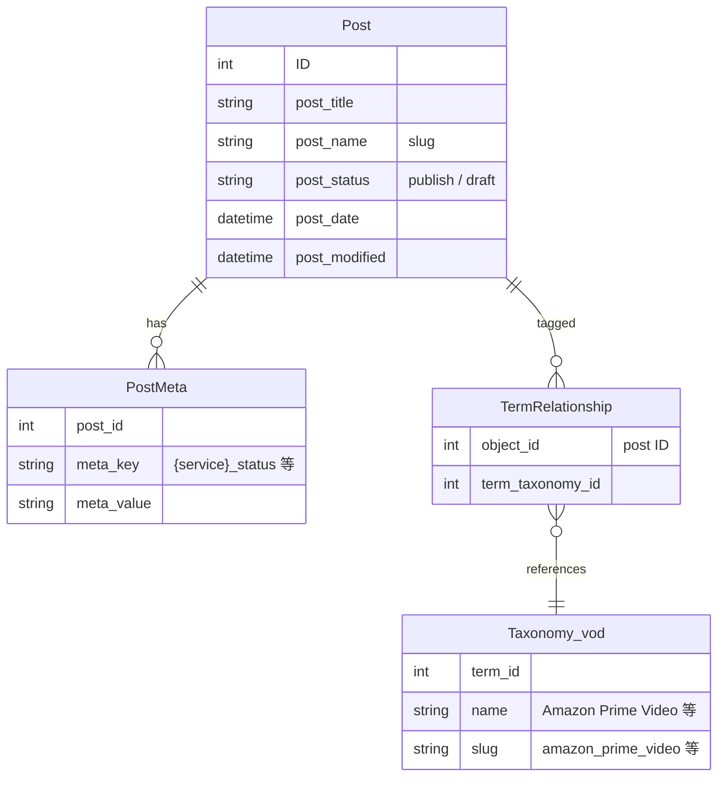

# データリレーション

WordPress ACF + taxonomy を中心としたデータ構造。

---

## ER 図



---

## ACF フィールド構造

各投稿 (post) に対してサービスごとにフラットフィールドを持つ。

```
post
└── acf
    │
    │  ── VOD サービスフィールド（8 サービス共通） ──
    │
    ├── amazon_prime_video_status               : streaming | rental | purchase | unavailable | ended | ''
    ├── amazon_prime_video_scraping_url         : url | ''
    ├── amazon_prime_video_price                : number | null
    ├── amazon_prime_video_updated_at           : "YYYY-MM-DD HH:MM:SS" | ''
    ├── amazon_prime_video_streaming_started_at : "YYYY-MM-DD HH:MM:SS" | ''
    │
    ├── netflix_status
    ├── netflix_scraping_url
    ├── netflix_price
    ├── netflix_updated_at
    ├── netflix_streaming_started_at
    │
    ├── hulu_*          （同上）
    ├── unext_*         （同上）
    ├── disney_plus_*   （同上）
    ├── dmm_tv_*        （同上）
    ├── apple_tv_*      （同上）
    ├── youtube_*       （同上）
    │
    │  ── 作品メタフィールド ──
    │
    ├── is_exclusive              : 0 | 1
    ├── exclusive_service         : vod term_id | null
    ├── lang                      : "ja" | "en"
    ├── scraping_disabled         : 0 | 1   （管理者による探索停止フラグ）
    ├── scraping_cooldown_until   : "YYYY-MM-DD" | ''  （次回チェック予定日）
    └── unavailable_check_count   : number  （連続未配信カウント、システム管理）
```

---

## taxonomy: vod

`status = streaming` のサービスを taxonomy タグとして付与する。
スクレイピング更新時に ACF status と同期して自動追加・削除される。

| term_id | name | slug |
|---|---|---|
| 433 | Amazon Prime Video | amazon_prime_video |
| 161 | Netflix | netflix |
| 72 | Hulu | hulu |
| 71 | U-NEXT | unext |
| 232 | Disney+ | disney_plus |
| 838 | DMM TV | dmm_tv |
| 1114 | Apple TV | apple-tv |
| 973 | YouTube | youtube |

---

## サービス定数（Python コード側）

`vod_scraping_api/utils/wordpress.py` で定義。

```python
SERVICES = [
    "amazon_prime_video",
    "netflix",
    "hulu",
    "unext",
    "disney_plus",
    "dmm_tv",
    "apple_tv",
    "youtube",
]

VOD_TERM_IDS = {
    "amazon_prime_video": 433,
    "netflix":            161,
    "hulu":               72,
    "unext":              71,
    "disney_plus":        232,
    "dmm_tv":             838,
    "apple_tv":           1114,
    "youtube":            973,
}
```
