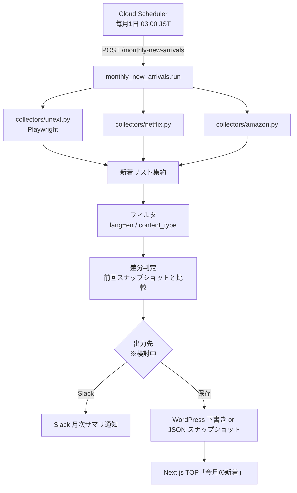
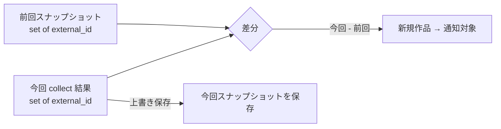
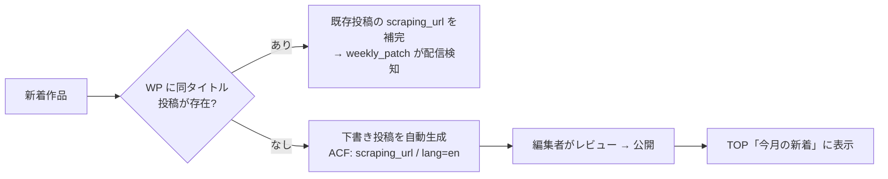
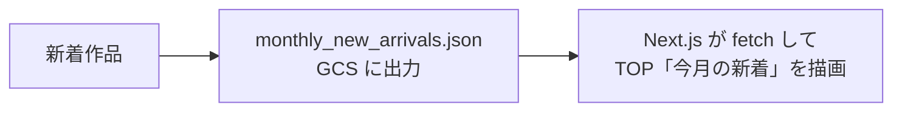

# 月次新着通知（Monthly New Arrivals）設計

U-NEXT / Netflix / Amazon Prime Video の **月ごとの新着作品** を発見し、通知・蓄積する仕組みの設計ドキュメント。

> ステータス: **設計検討中（Draft）**
> 対象ブランチ: `claude/vod-monthly-notification-scraper-Bxoti`

---

## 1. 目的とゴール

| 項目 | 内容 |
|---|---|
| 目的 | 主要 VOD（U-NEXT / Netflix / Amazon Prime Video）に**今月新しく登場した作品**を自動発見する |
| 最終ゴール | フロントエンド（Next.js）の **TOP ページ「今月の新着」セクション**に表示する |
| 通知 | 月次でまとめて **Slack 通知**する（運用監視・編集者への共有） |
| 初期対象 | **英語作品（洋画）のみ**。将来 **アニメ・ドラマ**へ拡張する |

### 既存システムとの違い

本機能は既存の `weekly_patch.py` とは**別系統のパイプライン**である。

| | 既存（weekly_patch） | 本機能（monthly_new_arrivals） |
|---|---|---|
| 方向性 | **監視**: 既に WP に登録済みの作品の配信状況を更新 | **発見**: サービス側の新着から WP 未登録の新作を発掘 |
| 入力 | WordPress 投稿一覧（`scraping_url` 既知） | 各サービスの**新着一覧ページ**（URL 未知） |
| 処理単位 | 作品 → 各サービス URL を巡回 | サービス → 新着リストを取得して作品を抽出 |
| コード | `checkers/`（`check(url)` で 1 作品を判定） | `collectors/`（`collect()` で新着一覧を取得） |
| 頻度 | 週次（バッチ 0-3） | 月次（毎月 1 回） |

> 既存の「新規配信検知（`notify_new_streaming`）」は *WP 登録済み* 作品が streaming に変わった瞬間を捉えるもの。
> 本機能は *WP 未登録* の新作そのものを捉える点が異なる。両者は補完関係にある。

---

## 2. 全体アーキテクチャ



---

## 3. データモデル

新着作品 1 件を表す中間データ構造（`dataclass`）。サービス横断で正規化する。

```python
@dataclass
class NewArrival:
    service: str            # "unext" | "netflix" | "amazon_prime_video"
    title: str             # 表示タイトル（日本語表記がある場合）
    original_title: str    # 原題（英語）
    url: str               # 作品ページ URL（既存 checker でそのまま再利用可能）
    external_id: str       # サービス内の作品 ID（差分判定キー）
    thumbnail: str         # サムネイル画像 URL
    release_year: int | None
    lang: str              # "en" | "ja"（初期は "en" のみ通す）
    content_type: str      # "movie" | "anime" | "drama"（初期は "movie"）
    available_since: str    # サービス上の配信開始日 "YYYY-MM-DD"（取得できる場合）
    collected_at: str       # 収集日時 "YYYY-MM-DD HH:MM:SS"
```

- `url` は既存 `checkers/` の入力形式と互換にする（後段で配信ステータス確認に再利用できる）。
- `external_id` を差分判定の一意キーにする（`{service}:{external_id}`）。

---

## 4. 収集方式（各サービスの新着ページを直接スクレイピング）

> 方針: JustWatch ではなく**各サービスの新着ページを直接スクレイピング**する。
> サービスごとに HTML 構造・防御機構が異なるため、`collectors/` に個別実装する。

### 4.1 ディレクトリ構成（追加分）

```
vod_scraping_api/
├── monthly_new_arrivals.py     # 月次ランナー（run() / CLI）
├── collectors/
│   ├── __init__.py             # NewArrival dataclass / 共通定数
│   ├── base.py                 # BaseCollector（collect() インターフェース）
│   ├── unext.py                # U-NEXT 新着コレクター（Playwright）
│   ├── netflix.py              # Netflix 新着コレクター
│   └── amazon.py               # Amazon Prime Video 新着コレクター
└── utils/
    └── snapshot.py             # 前回スナップショットの読み書き（差分判定用）
```

各コレクターは `BaseCollector` を継承し `collect() -> list[NewArrival]` を実装する
（`checkers/` の `check(url) -> dict` と対になる規約）。

### 4.2 サービス別の収集ポイントと技術的注意点

| サービス | 新着の入口（候補） | 取得方式 | 注意点 |
|---|---|---|---|
| **U-NEXT** | 「洋画 > 新着」ジャンル一覧 | **Playwright**（SPA / React） | JS レンダリング必須。既存 `checkers/unext.py` と同様にブラウザ描画後の DOM を取得。無限スクロール対策が必要 |
| **Netflix** | 「映画 > 新着」（言語=英語で絞り込み） | requests + BS4 →（不可なら Playwright） | 多くがログイン前提・地域別。公開ページで取れる範囲を見極める。`__NEXT_DATA__` / JSON-LD を優先的に解析 |
| **Amazon Prime Video** | 「Prime 会員特典 > 映画 > 新着」 | **Playwright** 推奨 | **robot 検出**あり（既存 `checkers/amazon.py` の `ROBOT_INDICATORS` 参照）。検出時は `RuntimeError` で当月スキップ |

> ⚠️ **要事前調査**: 3 サービスとも新着一覧の公開 URL・DOM 構造はログイン状態や地域で変動する。
> 実装前に各ページを実機確認し、セレクタを確定する PoC（概念実証）を 1 サービスずつ進める。

### 4.3 「英語作品（洋画）のみ」の判定

初期フェーズは `lang == "en"` の作品のみ通知対象とする。判定は以下の優先順で行う。

1. **入口で絞る**: 各サービスの「洋画」ジャンル/カテゴリ一覧ページから収集する（最も確実）
2. 原題（`original_title`）が ASCII 主体かどうかの補助判定
3. 既存 `SERVICE_SUPPORTED_LANGUAGES`（`utils/wordpress.py`）の言語規約と整合させる

将来の拡張（アニメ・ドラマ）は `content_type` と収集対象ジャンルを増やすだけで対応できる設計にする。

---

## 5. 差分判定（重複通知の防止）

毎月の実行で「**今回はじめて現れた作品**」だけを通知するため、前回収集分との差分を取る。



- スナップショットは `{service: [external_id, ...]}` の軽量 JSON。
- 保存先候補: **GCS**（Cloud Run 環境で永続化しやすい）または WordPress オプション。
- `available_since`（配信開始日）が確実に取れるサービスは、日付ベースの月次フィルタも併用してノイズを減らす。

---

## 6. 出力先（要決定事項）

> 最終ゴールは **TOP ページ表示**。保存先を WordPress にするか JSON にするかは未決定のため、両案を比較する。

### 案 A: WordPress に一元管理（既存の設計思想に整合）



- **長所**: データを WP に一本化（既存方針どおり）。フロントは既存の WP REST API で取得できる。編集者が品質をコントロールできる。
- **短所**: 投稿の自動生成・タイトル名寄せ・ACF マッピングの実装が必要。重複投稿のリスク。

### 案 B: JSON スナップショットをフロントが直接参照



- **長所**: WP 書き込み不要で実装が軽い。スクレイピング精度の検証を素早く回せる。
- **短所**: WP 一元管理から外れる。フロント側に新規 fetch ロジックが必要。

### 推奨ロードマップ

| フェーズ | 出力先 | 狙い |
|---|---|---|
| **Phase 1** | **Slack 通知 + JSON スナップショット** | スクレイピング精度を低リスクで検証。差分判定を安定化 |
| **Phase 2** | **WordPress 下書き投稿**（案 A） | 精度確認後、TOP 恒久表示を WP 一元管理に統合 |

> まず Phase 1（Slack + JSON）で「正しく新着が取れるか」を確認し、安定したら Phase 2 で WordPress 連携に昇格させる段階的導入を推奨。

---

## 7. エンドポイントとスケジューリング

### 7.1 HTTP エンドポイント（`main.py` に追加）

```
POST /monthly-new-arrivals
```

リクエストボディ（JSON）:

| キー | 型 | 説明 |
|---|---|---|
| `services` | string[] | 対象サービス。省略時は全 3 サービス |
| `lang` | string | 対象言語。省略時 `"en"` |
| `dry_run` | bool | 収集のみ（保存・通知なし） |
| `limit` | int | サービスあたりの最大収集件数（デバッグ用） |

レスポンス例:

```json
{
  "cycle": "2026-05",
  "services": {
    "unext":              {"collected": 42, "new": 8},
    "netflix":            {"collected": 30, "new": 5},
    "amazon_prime_video": {"collected": 55, "new": 12}
  },
  "filtered": {"lang_en": 25, "movie": 25},
  "new_total": 25,
  "errors": 0
}
```

### 7.2 Cloud Scheduler 推奨設定

```
毎月 1 日 03:00 JST → POST /monthly-new-arrivals
```

- 月次のため負荷は週次パッチより軽微。Playwright 利用サービス（U-NEXT / Amazon）が処理時間の大半を占める。

---

## 8. Slack 通知フォーマット（案）

`utils/slack.py` に `notify_monthly_new_arrivals(cycle, arrivals)` を追加する。

```
:sparkles: 2026年5月の新着（洋画）
━━━━━━━━━━━━━━━━━━
▼ U-NEXT（8件）
  • Dune: Part Two (2024)  https://video.unext.jp/title/SID...
  • ...
▼ Netflix（5件）
  • ...
▼ Amazon Prime Video（12件）
  • ...
合計 25 件
```

---

## 9. コーディング規約（本機能向け）

既存規約（`CLAUDE.md`）に準拠しつつ、収集系の規約を追加する。

- コレクターは `collectors/` に追加し `collect() -> list[NewArrival]` を実装する
- 戻り値は `NewArrival` のリストに統一する
- robot 検出・サーバーエラー時は `RuntimeError` を raise する（呼び出し元で当該サービスをスキップ）
- JS レンダリングが必要なサービスは Playwright を使用する（U-NEXT / Amazon）
- 新規コレクター追加時は `monthly_new_arrivals.py` の `_COLLECTOR_MAP` に登録する
- 環境変数はすべて `os.environ` 経由で参照する

---

## 10. 段階的実装ステップ（提案）

1. **PoC**: 1 サービス（U-NEXT 洋画新着）で `collect()` を実装し、DOM セレクタを確定
2. `collectors/base.py` + `NewArrival` データモデルを確定
3. 残り 2 サービス（Netflix / Amazon）のコレクターを実装
4. `utils/snapshot.py`（差分判定）+ Slack 月次通知を実装 → **Phase 1 リリース**
5. `monthly_new_arrivals.py` ランナー + `POST /monthly-new-arrivals` を実装
6. Cloud Scheduler 設定
7. **Phase 2**: WordPress 下書き連携（案 A）を実装し TOP ページ恒久表示へ

---

## 11. 未決定事項（次に決めること）

- [ ] **出力先の確定**: 案 A（WordPress）/ 案 B（JSON）/ 段階導入のいずれか
- [ ] スナップショット保存先: GCS / WordPress オプション
- [ ] 各サービス新着ページの**公開 URL とセレクタ**（PoC で確定）
- [ ] Netflix 新着が公開ページで取得可能かの実機検証（不可なら代替策）
- [ ] TOP「今月の新着」の表示仕様（フロント側との連携）
