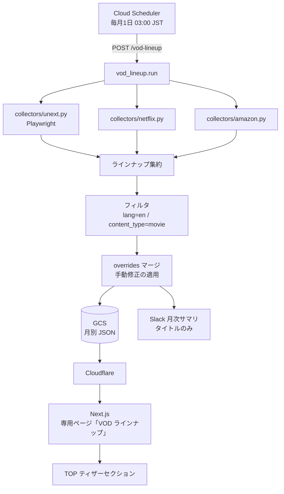
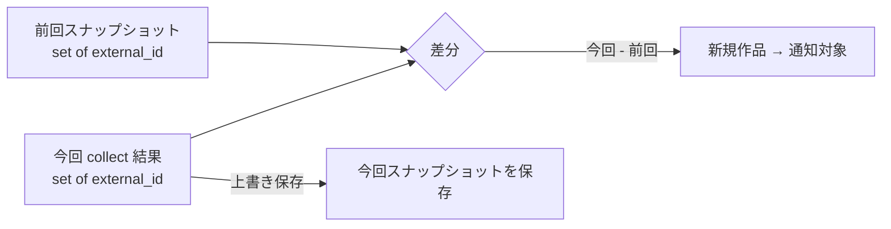
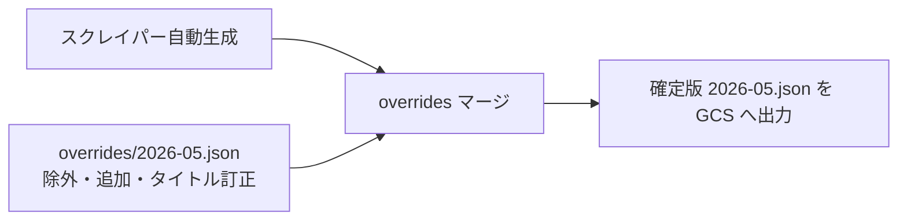

# VOD ラインナップ（vod-lineup）設計

U-NEXT / Netflix / Amazon Prime Video の **月ごとのラインナップ（新着作品）** を発見し、
通知・蓄積してフロントエンドの専用ページに表示する仕組みの設計ドキュメント。

> ステータス: **設計確定（出力先・運用フロー確定済み）／実装前**
> プロジェクト名: **VOD ラインナップ（vod-lineup）**
> 対象ブランチ: `claude/vod-monthly-notification-scraper-Bxoti`

> 「新着」という語は既存の TOP「新着配信」セクションと混同するため、
> 本機能は **「ラインナップ（lineup）」** という名称で統一する。

---

## 1. 目的とゴール

| 項目 | 内容 |
|---|---|
| 目的 | 主要 VOD（U-NEXT / Netflix / Amazon Prime Video）に**今月登場した作品**を自動発見する |
| 最終ゴール | フロントエンド（Next.js）の **専用ページ「VOD ラインナップ」** に表示する |
| 通知 | 月次でまとめて **Slack 通知**する（**タイトルのみ**のシンプルな内容） |
| 初期対象 | **英語作品（洋画）のみ**。将来 **アニメ・ドラマ**へ拡張する |

### 既存システムとの違い

本機能は既存の `weekly_patch.py` とは**別系統のパイプライン**である。

| | 既存「新着配信」(weekly_patch) | 本機能「VOD ラインナップ」 |
|---|---|---|
| 方向性 | **監視**: WP 登録済み作品の配信状況を更新 | **発見**: サービス側のラインナップから新作を発掘 |
| 対象 | WP 登録済み作品が直近 streaming 化 | サービスに新規登場した作品（WP 未登録含む） |
| 入力 | WordPress 投稿一覧（`scraping_url` 既知） | 各サービスの**ラインナップ/新着ページ**（URL 未知） |
| コード | `checkers/`（`check(url)` で 1 作品を判定） | `collectors/`（`collect()` で一覧を取得） |
| 頻度 | 週次 | 月次 |
| 出力 | WordPress ACF | **GCS の月別 JSON** |

> 名称も「新着配信」(既存) と「VOD ラインナップ」(本機能) で明確に分け、UI 上の混同を避ける。

---

## 2. 全体アーキテクチャ



---

## 3. データモデル

ラインナップ作品 1 件を表す中間データ構造（`dataclass`）。サービス横断で正規化する。

```python
@dataclass
class LineupItem:
    service: str            # "unext" | "netflix" | "amazon_prime_video"
    title: str             # 表示タイトル
    original_title: str    # 原題（英語）
    url: str               # 作品ページ URL（既存 checker でそのまま再利用可能）
    external_id: str       # サービス内の作品 ID（差分判定キー）
    release_year: int | None
    lang: str              # "en"（初期は en のみ通す）
    content_type: str      # "movie"（将来 "anime" / "drama" を追加）
    collected_at: str       # 収集日時 "YYYY-MM-DD HH:MM:SS"
```

- `url` は既存 `checkers/` の入力形式と互換にする（後段で配信ステータス確認に再利用可能）。
- `external_id` を差分判定の一意キーにする（`{service}:{external_id}`）。
- **Slack 通知・JSON 出力はタイトルのみ**でよい（最小構成）。上記の付随情報は将来の拡張・差分判定用に内部で保持する。

---

## 4. 収集方式（各サービスのラインナップページを直接スクレイピング）

> 方針: JustWatch ではなく**各サービスのラインナップ/新着ページを直接スクレイピング**する。

### 4.1 ディレクトリ構成（追加分）

```
vod_scraping_api/
├── vod_lineup.py               # 月次ランナー（run() / CLI）
├── collectors/
│   ├── __init__.py             # LineupItem dataclass / 共通定数
│   ├── base.py                 # BaseCollector（collect() インターフェース）
│   ├── unext.py                # U-NEXT コレクター（Playwright）
│   ├── netflix.py              # Netflix コレクター
│   └── amazon.py               # Amazon Prime Video コレクター
└── utils/
    ├── gcs.py                  # GCS への JSON 読み書き（出力・overrides・index）
    └── snapshot.py             # 前回スナップショットとの差分判定
```

各コレクターは `BaseCollector` を継承し `collect() -> list[LineupItem]` を実装する
（`checkers/` の `check(url) -> dict` と対になる規約）。

### 4.2 サービス別の収集ポイントと技術的注意点

| サービス | 収集の入口（候補） | 取得方式 | 注意点 |
|---|---|---|---|
| **U-NEXT** | 「洋画 > 新着」ジャンル一覧 | **Playwright**（SPA / React） | JS レンダリング必須。無限スクロール対策が必要 |
| **Netflix** | 「映画 > 英語作品」一覧 | requests + BS4 →（不可なら Playwright） | ログイン前提・地域別が多い。`__NEXT_DATA__` / JSON-LD を優先解析 |
| **Amazon Prime Video** | 「Prime > 映画 > 新着」 | **Playwright** 推奨 | **robot 検出**あり（`checkers/amazon.py` の `ROBOT_INDICATORS` 参照）。検出時は `RuntimeError` で当該サービスをスキップ |

> ⚠️ **要事前調査（PoC）**: 3 サービスとも公開 URL・DOM 構造はログイン状態や地域で変動する。
> 実装前に各ページを実機確認し、セレクタを確定する。1 サービス（U-NEXT）から着手する。

### 4.3 「英語作品（洋画）のみ」の判定

初期フェーズは `lang == "en"` の作品のみ対象とする。

1. **入口で絞る**: 各サービスの「洋画」ジャンル一覧から収集する（最も確実）
2. 原題が ASCII 主体かどうかの補助判定
3. 既存 `SERVICE_SUPPORTED_LANGUAGES`（`utils/wordpress.py`）の言語規約と整合させる

将来のアニメ・ドラマ拡張は `content_type` と収集対象ジャンルを増やすだけで対応できる設計にする。

---

## 5. 差分判定（重複通知の防止）

毎月「**今回はじめて現れた作品**」だけを通知するため、前回収集分との差分を取る。



- スナップショットは `{service: [external_id, ...]}` の軽量 JSON（GCS に保存）。
- 月別 JSON 出力とは別に、差分判定用スナップショットを保持する。

---

## 6. 出力先：GCS 月別 JSON（確定）

> 出力先は **Google Cloud Storage（GCS）の月別 JSON** に確定。
> 理由: Cloud Run はエフェメラルで永続ストレージが必須／既存の **Workload Identity Federation**
> で SA キー不要のまま書き込める／フロントは公開 URL を fetch するだけで WordPress を経由しない。

### 6.1 バケット構成（月別ファイル分割）

```
gs://vod-lineup/
├── index.json              # 利用可能な月リスト（フロントの月セレクタ用）例: ["2026-05","2026-04"]
├── 2026-05.json            # スクレイパーが自動生成（毎月上書き）
├── 2026-04.json            # 過去月（アーカイブ）
└── overrides/
    └── 2026-05.json        # 手動修正・除外リスト（スクレイパーは生成・上書きしない）
```

月別ファイル分割により、専用ページの**月セレクタ＝ファイル選択**となり実装が軽い。

### 6.2 出力 JSON（タイトルのみのシンプル構造）

`2026-05.json`:
```json
{
  "cycle": "2026-05",
  "updated_at": "2026-05-01 03:10:00",
  "services": {
    "unext":              ["Dune: Part Two", "Oppenheimer"],
    "netflix":            ["..."],
    "amazon_prime_video": ["..."]
  }
}
```

### 6.3 公開・読み取り（Cloudflare 前段 ＝ デフォルト）

- 既存 Cloudflare に `cdn.example.com/vod-lineup/...` を通し、GCS を**オリジン**にする。
- **同一オリジン化で CORS 不要**＋エッジキャッシュが効く。
- フロントは `https://cdn.example.com/vod-lineup/2026-05.json` を `fetch`。
- 月次更新・タイトルのみのためファイルは数 KB、コストはほぼゼロ。

### 6.4 必要な準備（バックエンド側）

- `requirements.txt` に `google-cloud-storage` を追加
- Cloud Run の SA に対象バケットの `roles/storage.objectAdmin`（WIF なのでキー不要）
- 環境変数 `GCS_LINEUP_BUCKET` を追加（`os.environ` 経由・ハードコード禁止）

---

## 7. 運用フロー：自動上書き・overrides・バージョニング

> GCS オブジェクトは**部分編集不可・ファイル単位の丸ごと上書き**。
> これを前提に「自動更新」「手動修正」「事故復旧」を分離して設計する。
> なお、スクレイピング由来のため**タイトル修正は頻発しない想定**であり、overrides は軽量な保険として用意する。

### 7.1 通常更新（自動・基本）

月次ランナーが `{cycle}.json` を**生成して丸ごと上書き**する（冪等）。
スクレイピングを回し直せば最新内容に置き換わる。これが基本の更新経路。

### 7.2 手動修正（軽微な手直し）

タイトル誤り・1 件削除などは `gcloud storage` で DL → 編集 → 再アップロード。

```bash
# ダウンロード
gcloud storage cp gs://vod-lineup/2026-05.json ./2026-05.json
# エディタで修正（タイトル訂正・不要作品の削除）
# アップロード（上書き）
gcloud storage cp ./2026-05.json gs://vod-lineup/2026-05.json
```

> GCP コンソールでも「DL → 編集 → UP」の流れは同じ（ブラウザ上での直接編集は不可）。

### 7.3 overrides 層（手動修正を恒久化したい場合）

7.2 の手動修正は、次回の自動上書きで**消える**。恒久的に残したい修正は
`overrides/{cycle}.json` に記述し、ランナーが生成時にマージする。



`overrides/2026-05.json` の例:
```json
{
  "exclude": ["amazon_prime_video:誤ったタイトル"],
  "rename":  {"unext:SID0123456": "正しいタイトル"},
  "add":     {"netflix": ["手動追加タイトル"]}
}
```

> 想定では修正は稀なため、まずは overrides なし（「直したら再アップ／必要なら再実行」）で開始し、
> 運用上必要になったら overrides マージを有効化する段階導入でよい。

### 7.4 事故復旧：Object Versioning

誤った上書きから戻せるよう、バケットにバージョニングを有効化する。

```bash
gcloud storage buckets update gs://vod-lineup --versioning
```

上書き前の世代が残り、ミス時にロールバックできる。

---

## 8. エンドポイントとスケジューリング

### 8.1 HTTP エンドポイント（`main.py` に追加）

```
POST /vod-lineup
```

リクエストボディ（JSON）:

| キー | 型 | 説明 |
|---|---|---|
| `services` | string[] | 対象サービス。省略時は全 3 サービス |
| `lang` | string | 対象言語。省略時 `"en"` |
| `dry_run` | bool | 収集のみ（GCS 保存・通知なし） |
| `limit` | int | サービスあたりの最大収集件数（デバッグ用） |

レスポンス例:
```json
{
  "cycle": "2026-05",
  "services": {
    "unext":              {"collected": 42, "new": 8},
    "netflix":            {"collected": 30, "new": 5},
    "amazon_prime_video": {"collected": 55, "new": 12}
  },
  "filtered": {"lang_en": 25, "movie": 25},
  "new_total": 25,
  "gcs_object": "gs://vod-lineup/2026-05.json",
  "errors": 0
}
```

### 8.2 Cloud Scheduler 推奨設定

```
毎月 1 日 03:00 JST → POST /vod-lineup
```

---

## 9. UI/UX：TOP ティザー ＋ 専用ページ

> 「1 ページだけ」ではなく **TOP ティザー + 専用一覧ページ**の 2 点セットを推奨。

### 9.1 TOP ティザーセクション（入口）

- 「今月の VOD ラインナップ（洋画）」を数件抜粋表示
- 「もっと見る →」で専用ページへ誘導
- 既存「新着配信」セクションとは**別ブロック**にして役割を明確化

### 9.2 専用ページ `/vod-lineup`

```
/vod-lineup
├─ 月セレクタ: [2026年5月 ▼]   ← index.json から月リストを取得
├─ サービスタブ: [すべて][U-NEXT][Netflix][Amazon]
├─ 種別フィルタ: [洋画]         ← 将来 [アニメ][ドラマ] を追加（拡張方針と一致）
└─ タイトル一覧（タイトルのみのシンプル表示）
```

- 月別 JSON の構造（`services` キー）がそのままサービスタブに対応する。
- 月セレクタは `index.json` のファイル選択 → 該当月 JSON を fetch するだけ。
- 「2026年5月 Netflix 新着 洋画」のような月アーカイブは SEO 資産になる。

---

## 10. コーディング規約（本機能向け）

- コレクターは `collectors/` に追加し `collect() -> list[LineupItem]` を実装する
- 戻り値は `LineupItem` のリストに統一する
- robot 検出・サーバーエラー時は `RuntimeError` を raise する（呼び出し元で当該サービスをスキップ）
- JS レンダリングが必要なサービスは Playwright を使用する（U-NEXT / Amazon）
- 新規コレクター追加時は `vod_lineup.py` の `_COLLECTOR_MAP` に登録する
- 環境変数はすべて `os.environ` 経由で参照する（`GCS_LINEUP_BUCKET` 等）

---

## 11. 段階的実装ステップ（提案）

1. **PoC**: U-NEXT 洋画新着で `collect()` を実装し、DOM セレクタを確定
2. `collectors/base.py` + `LineupItem` データモデルを確定
3. 残り 2 サービス（Netflix / Amazon）のコレクターを実装
4. `utils/gcs.py`（GCS 出力 / index.json 更新）+ `utils/snapshot.py`（差分判定）
5. Slack 月次通知（タイトルのみ）を実装
6. `vod_lineup.py` ランナー + `POST /vod-lineup` を実装
7. Cloud Scheduler + Cloudflare 前段を設定
8. フロント: 専用ページ `/vod-lineup` + TOP ティザーを実装
9. （必要時）overrides マージを有効化

---

## 12. 確定事項・残課題

### 確定
- [x] プロジェクト名: **VOD ラインナップ（vod-lineup）**
- [x] 通知内容: **タイトルのみ**（Slack / JSON とも）
- [x] 出力先: **GCS 月別 JSON**（`gs://vod-lineup/{cycle}.json`）
- [x] 公開: **Cloudflare 前段**（同一オリジン化・CORS 不要）
- [x] 運用: **自動上書き ＋ overrides 層 ＋ Object Versioning**
- [x] UI: **TOP ティザー ＋ 専用ページ `/vod-lineup`**
- [x] 初期対象: **英語作品（洋画）**／将来アニメ・ドラマ拡張

### 残課題（実装前に決める）
- [ ] 各サービスのラインナップページの**公開 URL とセレクタ**（PoC で確定）
- [ ] Netflix が公開ページで取得可能かの実機検証（不可なら代替策）
- [ ] GCS バケット名・Cloudflare のサブドメイン（`cdn.example.com` 等）の確定
- [ ] overrides マージを初期から入れるか、運用開始後に追加するか
